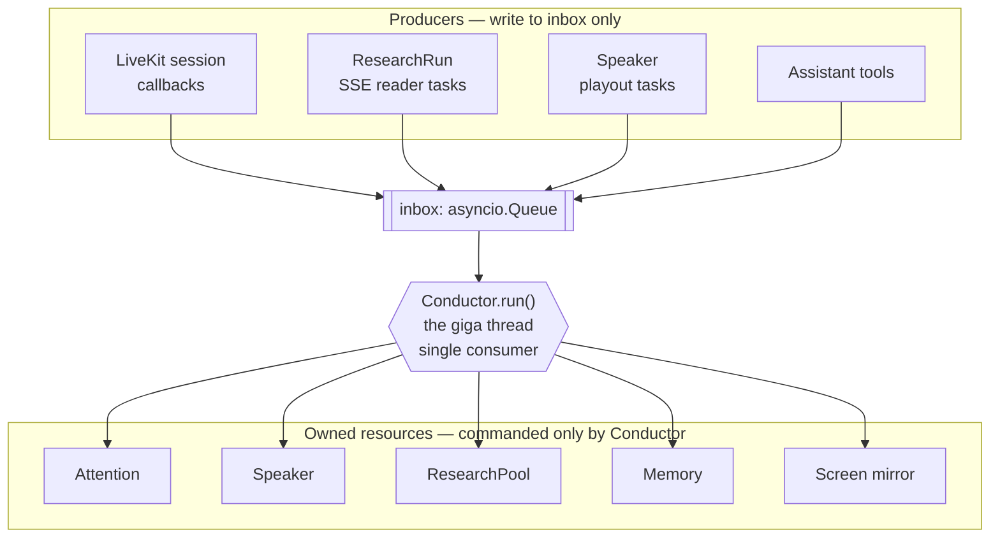
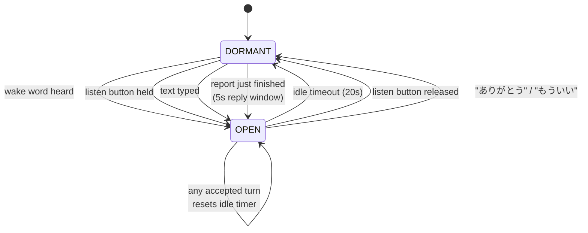
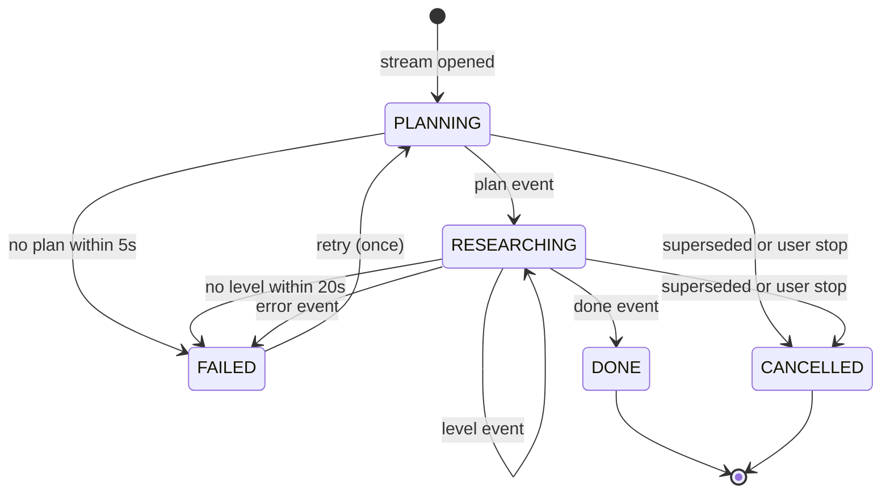
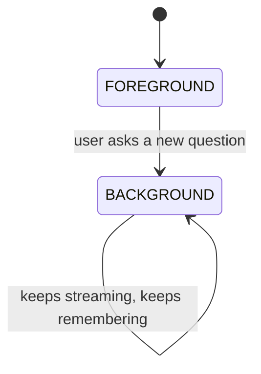
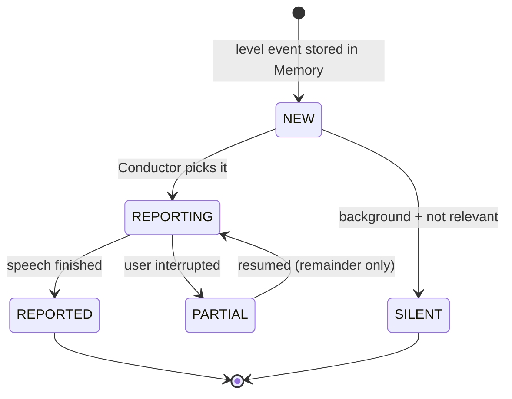
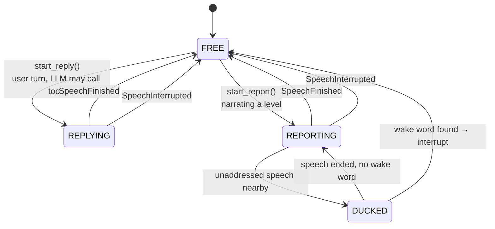

# Realtime Voice Wiki Assistant — v2 Design

Supersedes the v1 plan entirely. v1 described a system with two speech owners
(`SpeechScheduler` and `session.generate_reply`) competing for one audio
channel. This design has exactly one.

---

## 1. The one idea

**One thread decides everything. Nothing else decides anything.**

The GPU analogy holds: a giga thread does not do work, it *dispatches* work and
reads back completion. Long operations (SSE streams, LLM generation, TTS
playout) run as detached tasks that report completion by pushing an event into a
single inbox. The giga thread — `Conductor` — reads that inbox one event at a
time and is the only place in the codebase that contains a decision.

What a junior can rely on:

- **No locks anywhere.** One consumer of one queue means no races to reason about.
- **All behavior lives in one `match` statement.** To learn what the app does,
  read `Conductor.handle`. Nothing is hidden in a callback.
- **Anything slow is a task, never an `await` inside the loop.** The Conductor
  never blocks on TTS, so a barge-in is always processed within one event.

### What the system imitates

A coworker with a book:

| Behavior | Mechanism |
|---|---|
| Ignores you until called by name | `Attention` gate, wake word or push-to-talk |
| Talks normally when addressed | Casual turns never touch research |
| Reads the book when asked to find something | `research_wiki` tool opens an SSE run |
| First answer, then "let me check further" | Levels arrive one at a time, each is spoken |
| Remembers tangential findings | `Memory` retains every level, spoken or not |
| Handles a second question mid-read | New run becomes foreground, old goes background |
| Reports the old finding later, if relevant | Background levels speak with an attribution prefix |
| Stays quiet if the old finding is irrelevant | Background levels can be marked `SILENT` |
| Answers a quick aside instantly | Addressed user speech preempts every report |

### The rule that prevents the most bugs

**Attention gates input, never output.**

A dormant assistant still *reports*. If you asked a question and then stopped
addressing him, he still tells you what he found. Attention decides only whether
your speech is treated as a turn. Wiring it to output is the mistake that makes
research results silently vanish.

---

## 2. Files and classes

Eight files. Each class owns one thing and talks to as few others as possible.

| File | Class | Owns | Talks to |
|---|---|---|---|
| `events.py` | (dataclasses) | The vocabulary. No behavior. | nobody |
| `attention.py` | `Attention` | Addressed / dormant. Wake word, PTT, idle. | nobody |
| `speaker.py` | `Speaker` | The single speech slot. Only file touching TTS. | inbox |
| `research.py` | `ResearchRun`, `ResearchPool` | SSE streams, foreground/background. | inbox |
| `memory.py` | `Memory`, `LevelResult` | Every result ever received. | nobody |
| `conductor.py` | `Conductor` | **Every decision.** The giga thread. | all of the above |
| `agent.py` | `Assistant` | LLM instructions + 3 tools. | inbox, pool, memory |
| `server.py` | — | FastAPI token endpoint, worker bootstrap. | nothing |

Deleted: `scheduler.py`, `delivery.py`. Their live behavior moves to `Speaker` +
`Memory`; their dead behavior (ETA prediction, backpressure compaction) is not
recreated — it never ran.

### Topology



One arrow direction into the Conductor, one out. No class in `owned` calls
another class in `owned`. That is the whole interaction budget.

---

## 3. Events — the only vocabulary

`events.py` is frozen dataclasses and nothing else. If a behavior is not
expressible as one of these, it does not exist.

```python
@dataclass(frozen=True)
class UserStartedSpeaking: pass

@dataclass(frozen=True)
class UserSaidText:
    text: str
    from_text_input: bool          # typed, so addressing is implicit

@dataclass(frozen=True)
class ListenButtonChanged:
    held: bool                     # push-to-talk from the browser

@dataclass(frozen=True)
class ResearchRequested:
    question: str                  # posted by the research_wiki tool

@dataclass(frozen=True)
class PlanReady:
    run_id: str
    planned_levels: list[dict]

@dataclass(frozen=True)
class LevelReady:
    run_id: str
    level: dict                    # raw SSE level event

@dataclass(frozen=True)
class ResearchFailed:
    run_id: str
    reason: str                    # "plan_timeout" | "level_gap" | "stream_error"

@dataclass(frozen=True)
class ResearchFinished:
    run_id: str
    status: str                    # "complete" | "partial"

@dataclass(frozen=True)
class SpeechFinished:
    speech_id: str

@dataclass(frozen=True)
class SpeechInterrupted:
    speech_id: str
    spoken_char_count: int

@dataclass(frozen=True)
class IdleTick: pass             # 1 Hz, drives attention timeout
```

Twelve events. That is the complete surface between every moving part.

---

## 4. State machines

Four small machines. None of them knows about the others; the `Conductor` reads
all four and decides.

### 4.1 Attention — is the user talking to us?



Wake words: `モーヴィ` `モービー` `モーヴィー` `movi` `moovy`. Stripped from the text
before the turn is dispatched.

**A finished report opens a 5s reply window.** He tells you something, you can
answer straight back without saying the wake word again.

> Rejected alternative: pinning `OPEN` for the whole duration of a research run.
> A run lasts 30s+, so in a shared office every unrelated comment in that window
> would be treated as a turn and interrupt the report. The reply window is tied
> to the moment he actually finished speaking, which is when a human would
> expect to be answered.

### 4.2 ResearchRun — one SSE stream



Orthogonal to state, every run carries a **focus**:



A background run is never cancelled just for being superseded. It finishes and
its levels are retained; whether they get *spoken* is a separate decision.

### 4.3 LevelResult — one answer chunk



`SILENT` and `REPORTED` levels stay in `Memory` forever. `read_result` can reach
both. This is the "remembers it in case you want clarification" requirement —
not speaking something is not the same as forgetting it.

### 4.4 Speaker — the single slot



**Two-tier barge-in.** Someone talking near the mic is not necessarily talking
to us:

- speech starts while `DORMANT` → **duck** (drop volume), keep playing
- transcript arrives with no wake word → **unduck**, discard the transcript
- transcript arrives with a wake word → **interrupt**, treat as a turn
- speech starts while `OPEN` → **interrupt immediately**

---

## 5. The Conductor loop — what fires when

The entire program, in one readable block:

```python
async def run(self):
    while True:
        event = await self.inbox.get()
        await self.handle(event)
        await self.speak_next()      # after EVERY event
```

`speak_next()` after every event is what makes the system reactive: any change
in the world immediately re-evaluates what should be coming out of the speaker.

### 5.1 `handle` — the decision table

| Event | What happens |
|---|---|
| `ListenButtonChanged(held=True)` | `attention.open("button")` |
| `ListenButtonChanged(held=False)` | `attention.close()` unless research in flight |
| `UserStartedSpeaking` | `OPEN` → `speaker.interrupt()`. `DORMANT` → `speaker.duck()` |
| `UserSaidText` | `attention.accept(text)` decides. Rejected → `speaker.unduck()`, drop. Accepted → see 5.2 |
| `ResearchRequested` | old foreground → `BACKGROUND`; `pool.start(question)` |
| `PlanReady` | `run.planned_levels = ...`; foreground → queue a plan preview |
| `LevelReady` | `memory.remember(...)`; `screen.publish(...)`; level is now `NEW` |
| `ResearchFailed` | retry once; second failure → queue an apology report |
| `ResearchFinished` | mark run `DONE`; unpin the attention idle timer |
| `SpeechFinished` | level → `REPORTED`; speaker `FREE` |
| `SpeechInterrupted` | level → `PARTIAL` with `spoken_char_count`; speaker `FREE` |
| `IdleTick` | `attention.tick()` — may close after 20s |

### 5.2 An accepted user turn

```
attention.accept(text) -> Turn(accepted=True, text=cleaned, command=...)
```

`command` is one of `none | stop | repeat | continue | close`:

| Command | Match | Action |
|---|---|---|
| `stop` | 「やめて」「もういい」「キャンセル」 | `pool.cancel_all()`, say "止めました" |
| `repeat` | 「もう一回」「もう一度」 | last `REPORTED` level → `NEW` |
| `continue` | 「続き」「続けて」 | last `PARTIAL` level → `NEW` |
| `close` | 「ありがとう」 | `attention.close()` |
| `none` | anything else | `speaker.start_reply(text)` — the LLM decides |

Commands are plain regex, checked before the LLM. They must work when the LLM is
busy or wrong — "stop" that depends on a healthy LLM is not a stop.

### 5.3 `speak_next` — the priority ladder

Checked top to bottom, first match wins, exactly once per event:

```python
async def speak_next(self):
    if self.speaker.busy:              return   # 1. never preempt ourselves
    if self.user_is_speaking:          return   # 2. never talk over the user

    # 3. finish the sentence you cut me off in
    level = self.memory.next_partial(FOREGROUND)
    if level: return await self.report(level, resume=True)

    # 4. the question you just asked
    level = self.memory.next_new(FOREGROUND)
    if level: return await self.report(level)

    # 5. the sentence you cut me off in, about the OLD question
    level = self.memory.next_partial(BACKGROUND)
    if level: return await self.report(level, resume=True, attribute=True)

    # 6. new findings on the old question, only if still worth saying
    level = self.memory.next_new(BACKGROUND)
    if level and self.is_still_relevant(level):
        return await self.report(level, attribute=True)
    if level:
        return self.memory.mark_silent(level)
```

Partial-before-new within each focus is what produces "as I was saying —".
Foreground-before-background is "prefer the new query's results".
`attribute=True` prepends 「さっきの〇〇の件ですが、」 so a late answer is never
mistaken for an answer to the current question.

`is_still_relevant(level)` is deliberately dumb: speak it unless the user has
since said 「もういい」 about that run, or the run was superseded more than N levels
ago. Do not build a semantic relevance model. A slightly over-talkative
coworker is a much smaller problem than one that silently drops findings.

---

## 6. Timeline — the main interleaved case

Read top to bottom as lanes, left to right as time. Every lane except
`Conductor` is a *resource*; the `Conductor` lane is instantaneous decisions.

This single run covers: greeting, unaddressed chatter, wake word, research
start, plan preview, level report, barge-in, partial, second concurrent
question, background hold, background resume with attribution, and a memory
follow-up with no new research.

```mermaid
gantt
    title Main timeline - two overlapping questions with barge-in
    dateFormat X
    axisFormat %Ss
    todayMarker off

    section User
    hears greeting              :done,      u1, 0,  3s
    unaddressed chatter         :crit,      u2, 6,  2s
    wake word plus question A   :active,    u3, 9,  3s
    barge-in plus question B    :crit,      u4, 25, 2s
    follow-up about A           :active,    u5, 53, 2s

    section Attention
    OPEN reply window           :done,      a1, 0,  3s
    DORMANT                     :           a2, 3,  9s
    OPEN                        :active,    a3, 12, 48s

    section Conductor
    boot                        :milestone, c0, 0,  0s
    duck only                   :milestone, c1, 6,  0s
    no wake word so drop        :milestone, c2, 8,  0s
    accept turn A               :milestone, c3, 12, 0s
    start run A                 :milestone, c4, 13, 0s
    plan A ready                :milestone, c5, 16, 0s
    level A1 ready              :milestone, c6, 22, 0s
    interrupt speech            :milestone, c7, 25, 0s
    accept turn B               :milestone, c8, 27, 0s
    plan B ready                :milestone, c9, 29, 0s
    level A2 ready              :milestone, cA, 30, 0s
    level B1 ready              :milestone, cB, 35, 0s
    run B done                  :milestone, cC, 41, 0s
    accept follow-up            :milestone, cD, 55, 0s

    section Speaker
    greeting                    :done,      s1, 0,  3s
    reply A - tool call only    :done,      s2, 12, 1s
    plan preview A              :active,    s3, 16, 3s
    report A1 - cut off         :crit,      s4, 22, 3s
    plan preview B              :active,    s5, 29, 2s
    report B1                   :active,    s6, 35, 6s
    resume A1 remainder         :done,      s7, 41, 4s
    report A2 attributed        :done,      s8, 45, 6s
    reply from memory           :active,    s9, 55, 5s

    section Research A
    PLANNING                    :           r1, 13, 3s
    level 1 research            :active,    r2, 16, 6s
    level 2 research            :active,    r3, 22, 8s
    focus BACKGROUND            :crit,      r4, 27, 20s
    DONE                        :milestone, r5, 47, 0s

    section Research B
    PLANNING                    :           q1, 27, 2s
    level 1 research            :active,    q2, 29, 6s
    DONE                        :milestone, q3, 41, 0s

    section Memory
    A1 NEW                      :           m1, 22, 3s
    A1 PARTIAL                  :crit,      m2, 25, 16s
    A2 NEW held                 :crit,      m3, 30, 15s
    B1 NEW                      :           m4, 35, 6s
    read_result hit             :milestone, m5, 55, 0s
```



### What the user actually says

| t | Utterance |
|---|---|
| 6s | (colleague, not to us) — ducked, then discarded |
| 9s | 「モーヴィ、mpf_mfs_open って何？」 |
| 25s | 「待って、mpf_buf は？」 |
| 53s | 「その引数、もっと詳しく」 |

### The five moments that matter

| t | Moment | Rule that fires |
|---|---|---|
| **6→8s** | Chatter ducks but never interrupts | `DORMANT` + no wake word |
| **25s** | B interrupts A mid-sentence | `OPEN` → immediate interrupt; A1 → `PARTIAL` |
| **30s** | A2 arrives but stays silent | foreground B outranks background A |
| **41s** | A1's remainder finally lands | ladder rule 5, partial before new |
| **55s** | Follow-up costs zero research | `read_result` hits `Memory` |

---

## 7. Timeline — failure paths

### 7.1 Plan never arrives, retry succeeds

The 5s plan watchdog. Costs one wasted planning call, recovers silently — the
user never learns anything went wrong.

```mermaid
gantt
    title Plan timeout with successful retry
    dateFormat X
    axisFormat %Ss
    todayMarker off

    section User
    wake word plus question     :active,    p1, 0,  3s

    section Conductor
    accept turn                 :milestone, p2, 3,  0s
    plan watchdog fires at 5s   :milestone, p3, 9,  0s
    plan ready                  :milestone, p4, 12, 0s

    section Research
    attempt 1 PLANNING          :crit,      p5, 4,  5s
    POST agent-runs stop        :milestone, p6, 9,  0s
    attempt 2 PLANNING          :active,    p7, 9,  3s
    level 1 research            :active,    p8, 12, 6s

    section Speaker
    plan preview                :active,    p9, 12, 3s
    report level 1              :active,    pA, 18, 6s
```



### 7.2 Level stalls, retry also fails, apologise

The 20s level watchdog. Second failure is terminal — no third attempt. Already
reported levels stay valid and stay in `Memory`.

```mermaid
gantt
    title Level gap timeout then give up
    dateFormat X
    axisFormat %Ss
    todayMarker off

    section Conductor
    level 1 ready               :milestone, g1, 6,  0s
    level watchdog fires at 20s :milestone, g2, 26, 0s
    second failure so give up   :milestone, g3, 31, 0s

    section Research
    level 1 research            :active,    g4, 0,  6s
    level 2 stalled             :crit,      g5, 6,  20s
    retry PLANNING also fails   :crit,      g6, 26, 5s

    section Speaker
    report level 1              :active,    g7, 6,  6s
    apology report              :crit,      g8, 31, 3s

    section Memory
    level 1 REPORTED and kept   :done,      g9, 12, 24s
```



### 7.3 Background goes silent, then user stops everything

Two separate behaviours in one run: a background finding judged not worth
saying, and a hard stop that does not depend on the LLM being healthy.

```mermaid
gantt
    title Background silence and user stop
    dateFormat X
    axisFormat %Ss
    todayMarker off

    section User
    question A                  :active,    h1, 0,  2s
    question B                  :active,    h2, 8,  2s
    wake word plus stop command :crit,      h3, 24, 2s

    section Conductor
    A to BACKGROUND             :milestone, h4, 10, 0s
    A2 not relevant             :milestone, h5, 20, 0s
    stop matched before LLM     :milestone, h6, 26, 0s

    section Research A
    level 1 research            :active,    h7, 2,  6s
    focus BACKGROUND            :crit,      h8, 10, 16s
    CANCELLED                   :milestone, h9, 26, 0s

    section Research B
    level 1 research            :active,    i1, 10, 6s
    CANCELLED                   :milestone, i2, 26, 0s

    section Memory
    A2 NEW but stale            :crit,      i3, 20, 6s
    A2 marked SILENT            :milestone, i4, 26, 0s
    everything still readable   :done,      i5, 26, 8s

    section Speaker
    report A1                   :active,    i6, 2,  5s
    report B1                   :active,    i7, 16, 6s
    stop confirmation           :done,      i8, 26, 2s
```



`SILENT` is not deletion. At 26s every level from both runs is still reachable
by `read_result` — the user can ask 「さっきの件、結局どうだった」 and get an answer
with no new research.

---

## 8. Class sketches

Public surface only. A method is private only if it is called from two or more
places inside its own class; otherwise it is public and named for what it does.

```python
# attention.py
class Attention:
    state: str                     # "open" | "dormant"

    def open(self, because: str) -> None
    def close(self) -> None
    def open_reply_window(self, seconds: float) -> None
    def tick(self, now: float) -> None          # called by IdleTick
    def accept(self, text: str) -> Turn         # the whole gate, one call

@dataclass(frozen=True)
class Turn:
    accepted: bool
    text: str                      # wake word stripped
    command: str                   # "none" | "stop" | "repeat" | "continue" | "close"
```

```python
# speaker.py
class Speaker:
    busy: bool
    current_kind: str              # "reply" | "report" | "none"

    def start_reply(self, user_text: str) -> str        # returns speech_id
    def start_report(self, prompt: str) -> str
    def interrupt(self) -> None
    def duck(self) -> None
    def unduck(self) -> None
```

The only file that imports `AgentSession`. `start_*` launch a task and return
immediately; the task posts `SpeechFinished` or `SpeechInterrupted`.

```python
# research.py
class ResearchRun:
    run_id: str
    question: str
    state: str                     # PLANNING | RESEARCHING | DONE | FAILED | CANCELLED
    focus: str                     # FOREGROUND | BACKGROUND
    planned_levels: list[dict]

    async def start(self) -> None
    async def cancel(self) -> None

class ResearchPool:
    def start(self, question: str) -> ResearchRun
    def get(self, run_id: str) -> ResearchRun | None
    def foreground_run(self) -> ResearchRun | None
    def move_to_background(self, run: ResearchRun) -> None
    async def cancel_all(self) -> None
```

```python
# memory.py
@dataclass
class LevelResult:
    run_id: str
    question: str                  # the question this level belongs to
    objective: str
    text: str
    state: str                     # NEW | REPORTING | REPORTED | PARTIAL | SILENT
    spoken_char_count: int = 0

    @property
    def remaining_text(self) -> str

class Memory:
    def remember(self, run: ResearchRun, level: dict) -> LevelResult
    def next_new(self, focus: str) -> LevelResult | None
    def next_partial(self, focus: str) -> LevelResult | None
    def mark_silent(self, level: LevelResult) -> None
    def find(self, handle: str) -> LevelResult | None       # fuzzy, for read_result
    def summary_for_llm(self) -> str
```

`find` must not be exact-match. Order: exact objective → substring → token
overlap → **most recent level of the most recent run**. It never returns
"not found" while any level exists — that outcome pushes the LLM into starting a
redundant research run, which is far worse than reading a slightly wrong level.

---

## 9. Configuration

### 9.1 RAG knobs — stop asking for a shallow read

Current `VOICE_KNOBS` requests roughly half the retrieval the backend offers.
Match the endpoint's own defaults from `SSE_SPEC.md`:

```python
VOICE_KNOBS = {
    "max_levels": 3,
    "max_queries_per_level": 2,   # was 4 - unreachable in a 12s stage budget
    "search_limit": 16,           # was 8  - spec default
    "max_context_chars": 32_000,  # was 8_000 - spec default
    "min_initial_read_nodes": 16, # was not sent at all
    "deadline_seconds": 90,       # was not sent at all
}
```

Dropped: `max_recovery_levels` and `min_search_results` are documented no-ops.

`max_queries_per_level: 4` was never achievable — the backend serializes
generations and gives each level a 12s `stage_deadline_seconds`, so queries 3
and 4 were being cut every time.

### 9.2 Two TTS configurations, not one

One global `min_sentence_len=180` is why conversation has gaps. Split it:

| Speech kind | `min_sentence_len` | Why |
|---|---|---|
| reply (conversation) | 30 | first audio fast, short turns anyway |
| report (research prose) | 180 | one coherent Qwen synthesis, stable prosody |

`Speaker` picks the tokenizer per call. This is the only place the distinction
exists.

### 9.3 Watchdogs

| Env var | Default | Guards |
|---|---|---|
| `RAG_PLAN_TIMEOUT_SECONDS` | 5 | plan never arrives |
| `RAG_LEVEL_TIMEOUT_SECONDS` | 20 | gap between levels |
| `RAG_STREAM_MAX_RETRIES` | 1 | total attempts = 2 |
| `ATTENTION_IDLE_SECONDS` | 20 | OPEN → DORMANT |
| `ATTENTION_REPLY_WINDOW_SECONDS` | 5 | after a report finishes |

The watchdog **must** terminate on `done`, `error`, `cancelled`, and on a
`plan_update` that marks levels `skipped`. The current version only terminates
when every planned level completes, so a legitimately `partial` run re-runs the
whole question 20s after it already finished.

---

## 10. What gets deleted

| Thing | Why |
|---|---|
| `scheduler.py` | Replaced by `Speaker` + the ladder in `speak_next` |
| `delivery.py` | Replaced by `memory.py` |
| `EtaPredictor` | Never ran. Bridge/stretch/seamless was dead code |
| `compact_backpressure` | Never ran. `notify()` has no caller |
| `plan_ack` | Replaced by the plan-preview LLM pass |
| `ResearchCoordinator.handle_turn` | Replaced by `Conductor.handle` |
| `realtime_diff.txt` | 3029-line stray artifact containing `.env` values |

`.env` should also leave the index (`git rm --cached .env`, add to
`.gitignore`). It is dev credentials, but it is dev credentials in permanent
history.

---

## 11. Build order

Each step leaves the app runnable.

1. **`events.py` + `memory.py`** — pure data, fully unit-testable, no LiveKit.
2. **`attention.py`** — rewrite. Table-driven tests for wake word, PTT, idle,
   commands. Still no LiveKit.
3. **`speaker.py`** — wrap the session. Two TTS configs. Verify
   `SpeechInterrupted` carries a sane `spoken_char_count`.
4. **`research.py`** — move the SSE loop out of `server.py` unchanged, then fix
   the watchdog termination conditions and the knobs.
5. **`conductor.py`** — the loop and the ladder. Delete `scheduler.py` and
   `delivery.py` in this commit.
6. **`agent.py`** — instructions plus three tools: `research_wiki`,
   `read_result`, `stop_research`.
7. **Frontend** — push-to-talk button publishing `{"type":"listen","held":bool}`
   on the `attention` topic; wire the existing duck handler to real duck events.

---

## 12. Acceptance checks

Run these against the deployed box. Each maps to a lane in §6 or §7.

1. Colleague talks near the mic during a report → volume dips, report finishes,
   nothing is treated as a turn.
2. Interrupt a report, ask something else → old sentence resumes afterwards,
   prefixed with 「さっきの…」.
3. Ask B while A is still researching → B's answer comes first, A's later.
4. Say 「止めて」 while the LLM is mid-generation → everything stops.
5. Kill the RAG service mid-run → you hear an apology, not silence.
6. Ask a follow-up about a result from three questions ago → answered from
   `Memory`, no new SSE stream opens.
7. Say nothing for 30s → attention goes dormant; speaking without the wake word
   does nothing.
